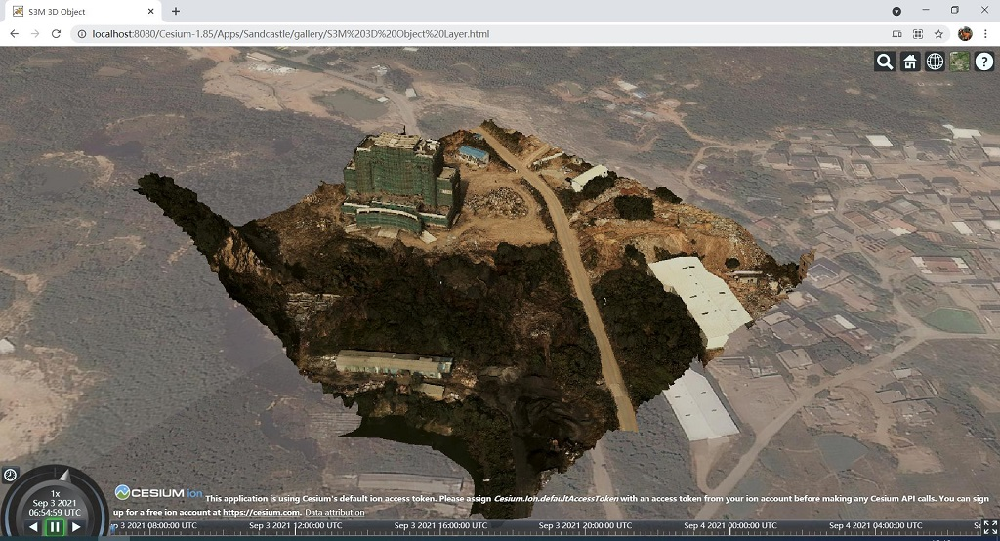

# Cesium_S3MLayer_Plugins

目前，该插件集支持以S3MTilesLayer或S3MDataSource两种形式加载S3M数据，效果如下

_使用S3M图层加载的北京CBD精模数据_

_使用S3M DataSource加载倾斜数据_

# 概述
Cesium_S3MLayer_Plugins是面向CesiumJS的插件，基于此可以在CesiumJS中高效快捷地实现iClient3D for Cesium产品的部分功能。S3MTilesLayer功能全面、性能优化，S3MDataSource则轻量便捷，满足用户的各类场景需求。

1、各类基础数据加载（精模，BIM，倾斜，点云（Draco点云暂不支持）
2、地形影像加载（TIN地形、栅格地形、block影像、block地形）
3、支持加载服务时使用token、 安全认证、多子域
4、支持entity贴s3m模型、支持entity同时贴倾斜以及地面
5、S3M图层设置透明度、支持查找图层、平面裁剪、压平、卷帘、id设置显隐，颜色，选中
6、量算、绘制和编辑线面
7、通视分析 、天际线、 视频投放

该插件集合还在持续优化完善中，条件成熟后会逐步开源。

## 插件集合
目前支持的插件有：

* [S3MTilesLayer](./S3MTilesLayer/)

    * 以图层形式在CesiumJS中加载S3M数据，并支持压平，裁剪等相关功能。

* [S3MDataSource](./S3MDataSource/)
    * 以数据源形式在CesiumJS 1.67-1.75中加载S3M数据，最终以3D Tiles形式展现。
