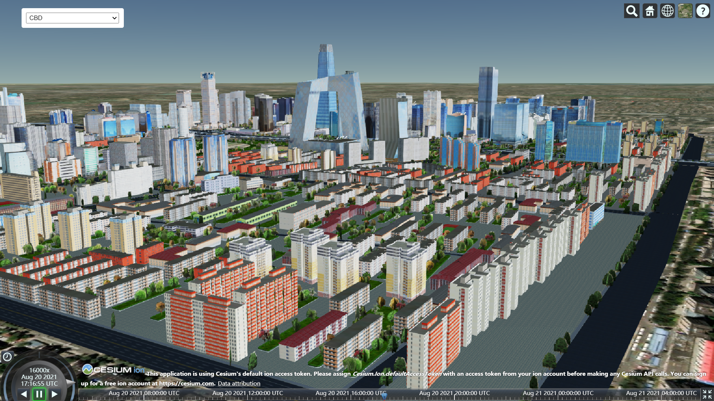

# Cesium_plugins

_使用S3M图层加载的北京CBD精模数据_

# 概述
Cesium_plugins是iClient3D for WebGL产品面向Cesium推出的插件集合，用户基于该插件，在Cesium中高效快捷的实现iClient3D for WebGL产品的部分功能。

目前，插件集合中提供了S3MTilesLayer和S3MDataSource两款插件，方便用户以图层或数据源的形式在Cesium中加载S3M数据及相关功能，满足不同的场景需求。

该插件集合会持续优化、完善，条件成熟后会逐步开源。

## 插件集合
目前支持的插件有：

* [S3MTilesLayer](./S3MTilesLayer/)

    * 以图层形式在Cesium中加载S3M数据，并开发相关功能

* [S3MDataSource](./S3MDataSource/)
    * 以数据源形式在Cesium中加载S3M数据