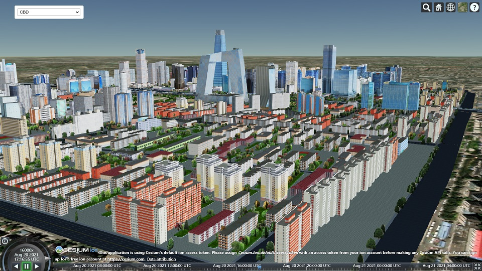
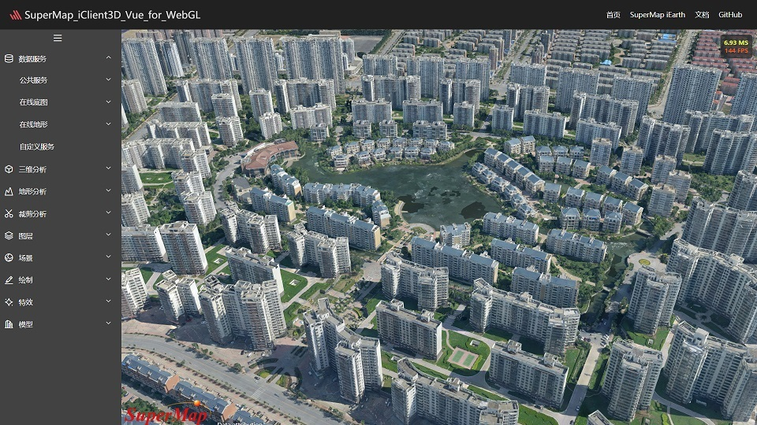
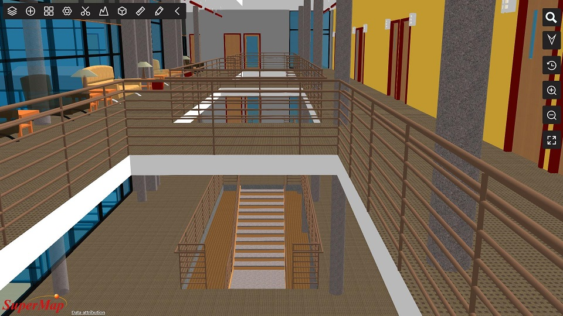

# iClient3D-for-WebGL — 三维“零客户端”开发平台

基于 WebGL 技术实现的三维客户端开发平台，可用于构建无插件、跨操作系统、 跨浏览器的三维 GIS 应用程序，可访问SuperMap iServer发布的多种服务、 实现了三维场景可视化浏览、交互操作和地理信息管理等功能。通过本产品可快速实现浏览器和移动端上美观、流畅的地图呈现与空间分析。

基于iClient3D-for-WebGL，我们提供了VUE组件包、iEarth在线应用程序，以及面向Cesium的插件集合Cesium_S3MLayer_Plugins。

围绕S3M数据规范，我们推出了相关的产品，插件以及组件，在轻量高效的同时，满足用户的各类应用。

_使用iClient3D-for-WebGL加载S3M数据_

_使用S3M图层加载的北京CBD精模数据_

_使用Vue组件加载倾斜数据_

_使用iEarth在线应用加载BIM数据_

# 周边

* [S3M ](https://github.com/SuperMap/s3m-spec)

    * S3M (Spatial 3D Model)是一种开放式、可扩展的三维地理空间数据格式，为海量多源异构空间三维模型数据在不同终端之间的传输、交换与共享提供数据格式的具体规范

* [Cesium_S3MLayer_Plugins](./Cesium_S3MLayer_Plugins/)
    * Cesium_plugins是iClient3D for WebGL产品面向Cesium推出的插件集合，用户基于该插件，在Cesium中高效快捷的实现iClient3D for WebGL产品的部分功能

* [iClient3D-vue](https://github.com/SuperMap/iClient3D-vue)
    * 在SuperMap_iClient3D_for_WebGL产品包基础上使用Vue框架进行封装，将三维应用的常用功能以组件的形式提供，使之轻量且高效

* [SuperMap-iEarth](https://github.com/SuperMap/SuperMap-iEarth)
    * SuperMap iEarth是基于全功能三维“零客户端”SuperMap iClient3D for WebGL开发的一款三维在线应用程序。在多源数据加载、三维空间分析以及多种可视化效果等功能的支撑下，用户可以通过SuperMap iEarth在浏览器上进行三维浏览及应用。